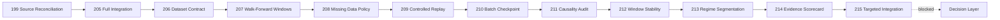

# QRDS Architecture - Phase 215

```mermaid
flowchart LR
  P199[199 Source Reconciliation] --> P205[205 Full Integration]
  P205 --> P206[206 Dataset Contract]
  P206 --> P207[207 Walk-Forward Windows]
  P207 --> P208[208 Missing Data Policy]
  P208 --> P209[209 Controlled Replay]
  P209 --> P210[210 Batch Checkpoint]
  P210 --> P211[211 Causality Audit]
  P211 --> P212[212 Window Stability]
  P212 --> P213[213 Regime Segmentation]
  P213 --> P214[214 Evidence Scorecard]
  P214 --> P215[215 Targeted Integration]
  P215 -. blocked .-> D[Decision Layer]
```

The decision layer remains blocked because research controls are not equivalent to predictive validation.
