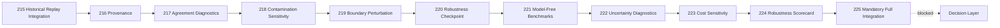

# QRDS Architecture - Phase 225

```mermaid
flowchart LR
  P215[215 Historical Replay Integration] --> P216[216 Provenance]
  P216 --> P217[217 Agreement Diagnostics]
  P217 --> P218[218 Contamination Sensitivity]
  P218 --> P219[219 Boundary Perturbation]
  P219 --> P220[220 Robustness Checkpoint]
  P220 --> P221[221 Model-Free Benchmarks]
  P221 --> P222[222 Uncertainty Diagnostics]
  P222 --> P223[223 Cost Sensitivity]
  P223 --> P224[224 Robustness Scorecard]
  P224 --> P225[225 Mandatory Full Integration]
  P225 -. blocked .-> D[Decision Layer]
```

The decision layer remains blocked.
