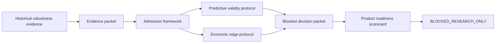

# QRDS Architecture - Phase 245

```mermaid
flowchart LR
  A[Historical robustness evidence] --> B[Evidence packet]
  B --> C[Admission framework]
  C --> D[Predictive validity protocol]
  C --> E[Economic edge protocol]
  D --> F[Blocked decision packet]
  E --> F
  F --> G[Product readiness scorecard]
  G --> H[BLOCKED_RESEARCH_ONLY]
```
