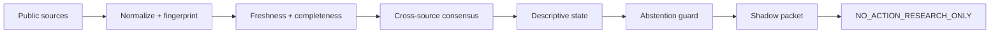

# QRDS Architecture - Phase 255

```mermaid
flowchart LR
 A[Public sources]-->B[Normalize + fingerprint]
 B-->C[Freshness + completeness]
 C-->D[Cross-source consensus]
 D-->E[Descriptive state]
 E-->F[Abstention guard]
 F-->G[Shadow packet]
 G-->H[NO_ACTION_RESEARCH_ONLY]
```
