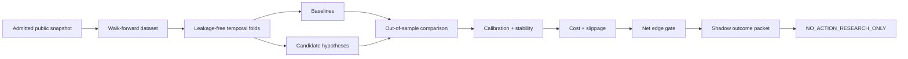

# QRDS Architecture - Phase 265

```mermaid
flowchart LR
 A[Admitted public snapshot] --> B[Walk-forward dataset]
 B --> C[Leakage-free temporal folds]
 C --> D[Baselines]
 C --> E[Candidate hypotheses]
 D --> F[Out-of-sample comparison]
 E --> F
 F --> G[Calibration + stability]
 G --> H[Cost + slippage]
 H --> I[Net edge gate]
 I --> J[Shadow outcome packet]
 J --> K[NO_ACTION_RESEARCH_ONLY]
```
