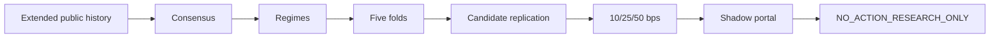

# QRDS Architecture - Phase 275

```mermaid
flowchart LR
 A[Extended public history]-->B[Consensus]
 B-->C[Regimes]
 C-->D[Five folds]
 D-->E[Candidate replication]
 E-->F[10/25/50 bps]
 F-->G[Shadow portal]
 G-->H[NO_ACTION_RESEARCH_ONLY]
```
