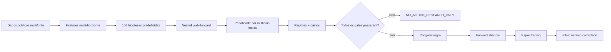

# QRDS Visual Project Map - Phase 285

```mermaid
flowchart LR
 A[Dados publicos multifonte] --> B[Features multi-horizonte]
 B --> C[108 hipoteses predefinidas]
 C --> D[Nested walk-forward]
 D --> E[Penalidade por multiplos testes]
 E --> F[Regimes + custos]
 F --> G{Todos os gates passaram?}
 G -- Nao --> H[NO_ACTION_RESEARCH_ONLY]
 G -- Sim --> I[Congelar regra]
 I --> J[Forward shadow]
 J --> K[Paper trading]
 K --> L[Piloto minimo controlado]
```

**Voce esta aqui:** validacao da busca controlada, antes do forward shadow.
