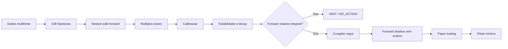

# QRDS Visual Project Map - Phase 295

```mermaid
flowchart LR
 A[Dados multifonte] --> B[108 hipoteses]
 B --> C[Nested walk-forward]
 C --> D[Multiplos testes]
 D --> E[Calibracao]
 E --> F[Estabilidade e decay]
 F --> G{Forward shadow elegivel?}
 G -- Nao --> H[WAIT / NO_ACTION]
 G -- Sim --> I[Congelar regra]
 I --> J[Forward shadow sem ordens]
 J --> K[Paper trading]
 K --> L[Piloto minimo]
```

**Voce esta aqui:** calibracao e gate de forward shadow.
