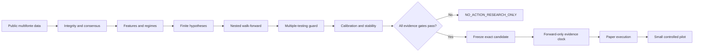

# QRDS Visual Project Map - Phase 300

```mermaid
flowchart LR
 A[Public multifonte data] --> B[Integrity and consensus]
 B --> C[Features and regimes]
 C --> D[Finite hypotheses]
 D --> E[Nested walk-forward]
 E --> F[Multiple-testing guard]
 F --> G[Calibration and stability]
 G --> H{All evidence gates pass?}
 H -- No --> I[NO_ACTION_RESEARCH_ONLY]
 H -- Yes --> J[Freeze exact candidate]
 J --> K[Forward-only evidence clock]
 K --> L[Paper execution]
 L --> M[Small controlled pilot]
```

**VOCE ESTA AQUI:** framework complete, evidence gates failed,
waiting for a better research candidate.
