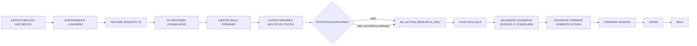

# QRDS Architecture Mermaid — Phase 305

```mermaid
flowchart LR
    A[DADOS PUBLICOS HISTORICOS] --> B[INTEGRIDADE E LINHAGEM]
    B --> C[FEATURE REGISTRY V2]
    C --> D[24 HIPOTESES CONGELADAS]
    D --> E[NESTED WALK-FORWARD]
    E --> F[CUSTOS REGIMES MULTIPLOS TESTES]
    F --> G{ESTRATEGIA APROVADA?}
    G -- NAO --> H[NO_ACTION_RESEARCH_ONLY]
    G -- SIM, HISTORICO APENAS --> H
    H --> I[VOCE ESTA AQUI]
    I --> J[AGUARDAR CANDIDATA ELEGIVEL E CONGELADA]
    J --> K[EVIDENCIA FORWARD SOMENTE FUTURA]
    K --> L[FORWARD SHADOW]
    L --> M[PAPER]
    M --> N[REAL]
```

**VOCE ESTA AQUI:** pesquisa histórica ampliada, ainda antes de uma candidata elegível congelada.
