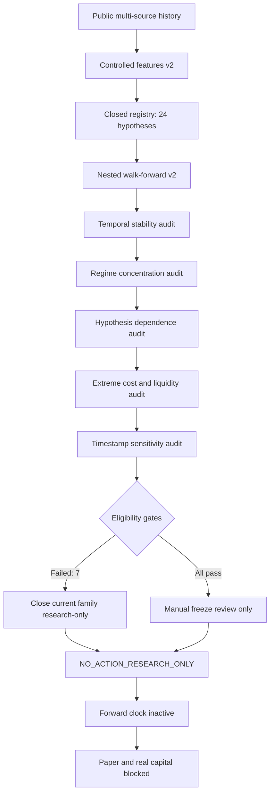

# QRDS Architecture Mermaid — Phase 315

**VOCE ESTA AQUI:** `CLOSE_CURRENT_FAMILY_RESEARCH_ONLY`. No immutable candidate freeze exists and
historical evidence has zero credit in the forward clock.
