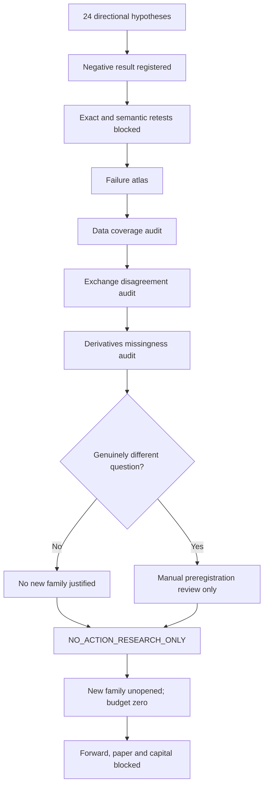

# QRDS Architecture Mermaid — Phase 325

```mermaid
flowchart TD
    A[24 directional hypotheses] --> B[Negative result registered]
    B --> C[Exact and semantic retests blocked]
    C --> D[Failure atlas]
    D --> E[Data coverage audit]
    E --> F[Exchange disagreement audit]
    F --> G[Derivatives missingness audit]
    G --> H{Genuinely different question?}
    H -->|No| I[No new family justified]
    H -->|Yes| J[Manual preregistration review only]
    I --> K[NO_ACTION_RESEARCH_ONLY]
    J --> K
    K --> L[New family unopened; budget zero]
    L --> M[Forward, paper and capital blocked]
```

**VOCE ESTA AQUI:** `MANUAL_PREREGISTRATION_REVIEW_ONLY_RESEARCH_ONLY`. Nenhuma família nova foi aberta.
