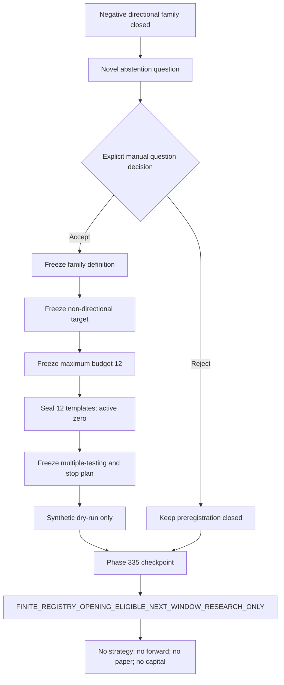

# QRDS Architecture Mermaid — Phase 335

```mermaid
flowchart TD
    A[Negative directional family closed] --> B[Novel abstention question]
    B --> C{Explicit manual question decision}
    C -->|Reject| D[Keep preregistration closed]
    C -->|Accept| E[Freeze family definition]
    E --> F[Freeze non-directional target]
    F --> G[Freeze maximum budget 12]
    G --> H[Seal 12 templates; active zero]
    H --> I[Freeze multiple-testing and stop plan]
    I --> J[Synthetic dry-run only]
    J --> K[Phase 335 checkpoint]
    D --> K
    K --> L[FINITE_REGISTRY_OPENING_ELIGIBLE_NEXT_WINDOW_RESEARCH_ONLY]
    L --> M[No strategy; no forward; no paper; no capital]
```

**VOCE ESTA AQUI:** Phase 335 checkpoint. The finite registry remains closed
until a later phase explicitly opens it under the frozen contract.
