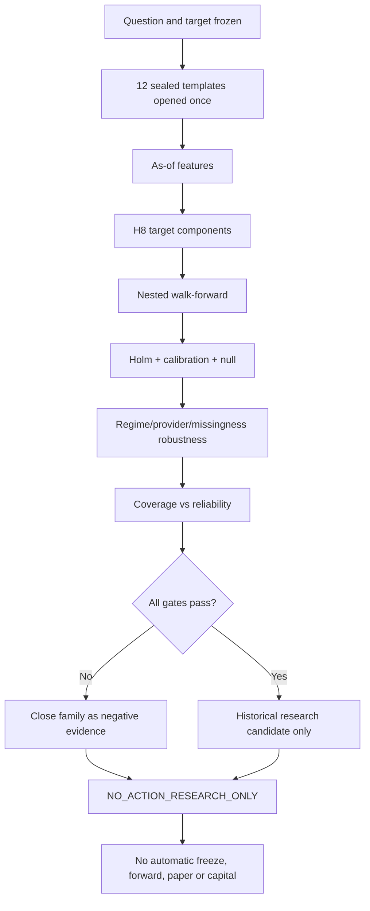

# QRDS Architecture Mermaid — Phase 345

```mermaid
flowchart TD
    A[Question and target frozen] --> B[12 sealed templates opened once]
    B --> C[As-of features]
    C --> D[H8 target components]
    D --> E[Nested walk-forward]
    E --> F[Holm + calibration + null]
    F --> G[Regime/provider/missingness robustness]
    G --> H[Coverage vs reliability]
    H --> I{All gates pass?}
    I -->|No| J[Close family as negative evidence]
    I -->|Yes| K[Historical research candidate only]
    J --> L[NO_ACTION_RESEARCH_ONLY]
    K --> L
    L --> M[No automatic freeze, forward, paper or capital]
```

**VOCE ESTA AQUI:** `ABSTENTION_FAMILY_CLOSED_NO_SURVIVOR_RESEARCH_ONLY`. Capital authorized: `R$ 0`.
