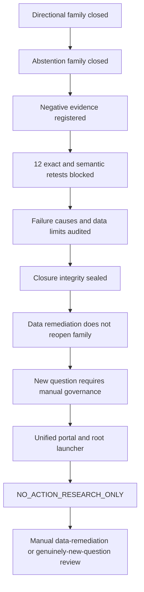

# QRDS Architecture Mermaid — Phase 355

```mermaid
flowchart TD
    A[Directional family closed] --> B[Abstention family closed]
    B --> C[Negative evidence registered]
    C --> D[12 exact and semantic retests blocked]
    D --> E[Failure causes and data limits audited]
    E --> F[Closure integrity sealed]
    F --> G[Data remediation does not reopen family]
    G --> H[New question requires manual governance]
    H --> I[Unified portal and root launcher]
    I --> J[NO_ACTION_RESEARCH_ONLY]
    J --> K[Manual data-remediation or genuinely-new-question review]
```

**VOCE ESTA AQUI:** unified navigation is ready, while science remains blocked with zero active hypotheses and `R$ 0` capital.
