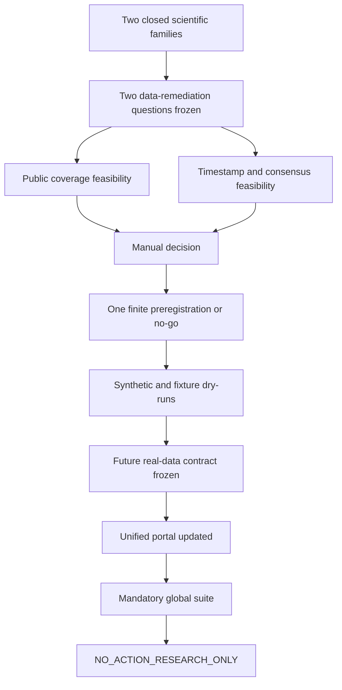

# QRDS Architecture Mermaid — Phase 365

```mermaid
flowchart TD
 A[Two closed scientific families] --> B[Two data-remediation questions frozen]
 B --> C[Public coverage feasibility]
 B --> D[Timestamp and consensus feasibility]
 C --> E[Manual decision]
 D --> E
 E --> F[One finite preregistration or no-go]
 F --> G[Synthetic and fixture dry-runs]
 G --> H[Future real-data contract frozen]
 H --> I[Unified portal updated]
 I --> J[Mandatory global suite]
 J --> K[NO_ACTION_RESEARCH_ONLY]
```

**VOCE ESTA AQUI:** `MANUAL_REAL_DATA_REMEDIATION_EXECUTION_REVIEW_ONLY_RESEARCH_ONLY`. Capital authorized: `R$ 0`.
