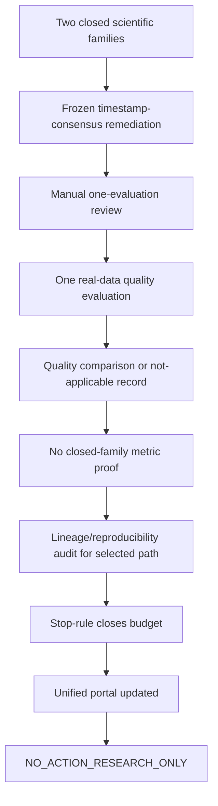

# QRDS Architecture Mermaid — Phase 375

```mermaid
flowchart TD
 A[Two closed scientific families] --> B[Frozen timestamp-consensus remediation]
 B --> C[Manual one-evaluation review]
 C --> D[One real-data quality evaluation]
 D --> E[Quality comparison or not-applicable record]
 E --> F[No closed-family metric proof]
 F --> G[Lineage/reproducibility audit for selected path]
 G --> H[Stop-rule closes budget]
 H --> I[Unified portal updated]
 I --> J[NO_ACTION_RESEARCH_ONLY]
```

**VOCE ESTA AQUI:** `MANUAL_REMEDIATED_RESEARCH_DATASET_ADOPTION_REVIEW_ONLY_RESEARCH_ONLY`. Capital authorized: `R$ 0`.
