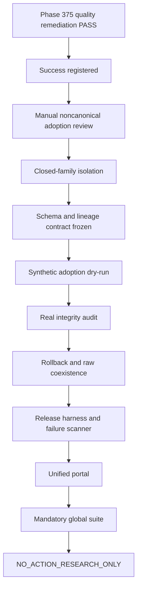

# QRDS Architecture Mermaid — Phase 385

```mermaid
flowchart TD
 A[Phase 375 quality remediation PASS] --> B[Success registered]
 B --> C[Manual noncanonical adoption review]
 C --> D[Closed-family isolation]
 D --> E[Schema and lineage contract frozen]
 E --> F[Synthetic adoption dry-run]
 F --> G[Real integrity audit]
 G --> H[Rollback and raw coexistence]
 H --> I[Release harness and failure scanner]
 I --> J[Unified portal]
 J --> K[Mandatory global suite]
 K --> L[NO_ACTION_RESEARCH_ONLY]
```

**VOCE ESTA AQUI:** `NONCANONICAL_DATASET_OBSERVATION_AND_RELEASE_GATE_HARDENING_ONLY_RESEARCH_ONLY`. Capital authorized: `R$ 0`.
