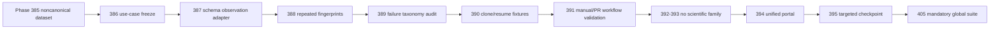

# QRDS Architecture — Phase 395

```mermaid
flowchart LR
    A[Phase 385 noncanonical dataset] --> B[386 use-case freeze]
    B --> C[387 schema observation adapter]
    C --> D[388 repeated fingerprints]
    D --> E[389 failure taxonomy audit]
    E --> F[390 clone/resume fixtures]
    F --> G[391 manual/PR workflow validation]
    G --> H[392-393 no scientific family]
    H --> I[394 unified portal]
    I --> J[395 targeted checkpoint]
    J --> K[405 mandatory global suite]
```

All nodes remain `RESEARCH_ONLY`.
