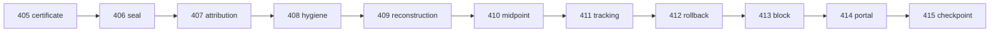

# QRDS Architecture — Phase 415

```mermaid
flowchart LR
A[405 certificate]-->B[406 seal]-->C[407 attribution]-->D[408 hygiene]-->E[409 reconstruction]-->F[410 midpoint]-->G[411 tracking]-->H[412 rollback]-->I[413 block]-->J[414 portal]-->K[415 checkpoint]
```
