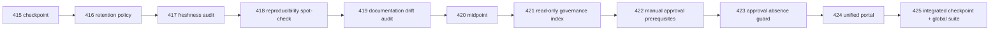

# QRDS Architecture — Phase 425

```mermaid
flowchart LR
    A[415 checkpoint] --> B[416 retention policy]
    B --> C[417 freshness audit]
    C --> D[418 reproducibility spot-check]
    D --> E[419 documentation drift audit]
    E --> F[420 midpoint]
    F --> G[421 read-only governance index]
    G --> H[422 manual approval prerequisites]
    H --> I[423 approval absence guard]
    I --> J[424 unified portal]
    J --> K[425 integrated checkpoint + global suite]
```

All nodes remain `RESEARCH_ONLY`.
