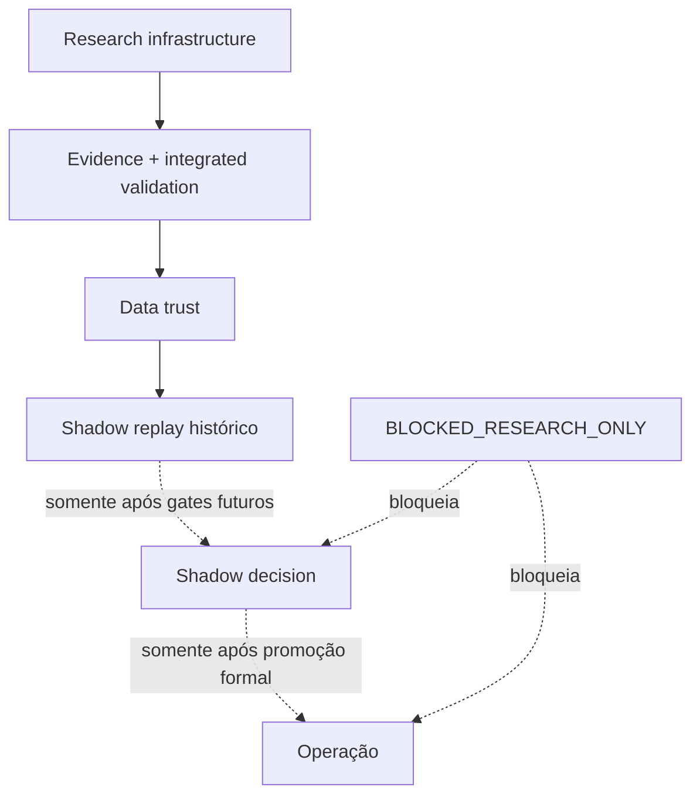

# QRDS / QOS / GATE BTC — Master Progress by Tens

**Baseline:** Phase 195
**Checkpoint remoto:** `f5d3708`
**Estado:** `PASS_RESEARCH_ONLY`
**Operação:** `BLOCKED_RESEARCH_ONLY`

---

## 1. Resumo executivo

O projeto já ultrapassou a etapa de simples construção modular. A fundação de engenharia, o pipeline offline de pesquisa, os artifacts, os portais de revisão, a governança de evidência e as camadas de bloqueio foram integrados e submetidos a uma regressão ampla.

O marco decisivo ocorreu nas Phases **191–195**:

- 428 arquivos de teste congelados em manifest imutável;
- Shards A, B e C executados separadamente;
- todos os testes coletados em cada shard aprovados;
- 0 failures;
- 0 errors;
- 428 hashes verificados;
- consolidação final concluída;
- push remoto concluído no commit `f5d3708`.

A leitura correta do estado atual é:

> O sistema está consolidado como plataforma de pesquisa auditável, mas ainda não está autorizado a decidir, recomendar, alocar ou operar capital.

---

## 2. Mapa de maturidade atual

| Camada | Estado | Leitura |
|---|---|---|
| Fundação de engenharia | **Consolidada** | Estrutura modular, CLI, artifacts, contratos e testes presentes |
| Pipeline quantitativo offline | **Consolidado para pesquisa** | Dados, features, regimes, targets, dataset, baseline, replay e relatórios |
| Portal e revisão humana | **Consolidado para pesquisa** | Índices, páginas, serve local, UX e trilhas de leitura |
| Evidência e journal replay | **Consolidado** | Artifacts, checkpoints, intake, export e auditoria |
| Governança de promoção | **Consolidada e bloqueante** | Shadow readiness, promotion blockers e gap matrix |
| Regressão integrada | **Aprovada** | 428 arquivos, 3 shards, 0 failures, 0 errors |
| Confiança de dados | **Próxima frente** | Linhagem, frescor, gaps, duplicatas e reconciliação |
| Shadow replay validado | **Próxima frente** | Reprodutibilidade histórica sem decisão operacional |
| Shadow decision | **Bloqueado** | `shadow_decision_allowed = False` |
| Camada de decisão | **Bloqueada** | `decision_layer_allowed = False` |
| Produção / capital real | **Bloqueado** | sem ordens, sem safe apply, sem canonical writes |

---

## 3. Diagrama executivo

```mermaid
flowchart LR
    A["0–19<br/>Fundação + pipeline offline"] --> B["20–39<br/>Modelagem, anti-overfit e portal"]
    B --> C["40–79<br/>QA, contracts, runners e release"]
    C --> D["80–119<br/>Journal replay + review portal"]
    D --> E["120–159<br/>UX, evidência e governança"]
    E --> F["160–185<br/>Shadow readiness + blockers + gaps"]
    F --> G["186–190<br/>Regressão integrada preparatória"]
    G --> H["191–195<br/>Manifest + Shards A/B/C + consolidação"]
    H --> I["196–205<br/>Data trust + shadow replay validation"]

    classDef done fill:#d9ead3,stroke:#38761d,stroke-width:2px,color:#1b1b1b;
    classDef next fill:#fff2cc,stroke:#bf9000,stroke-width:2px,color:#1b1b1b;
    class A,B,C,D,E,F,G,H done;
    class I next;
```



### Gate transversal



---

## 4. Progresso por blocos de 10 fases

> **Precisão:** “Alta” indica evidência recente ou milestones conhecidos com clareza. “Gerencial” indica síntese macro da evolução, não auditoria título a título.

| Bloco | Status | Tema principal | Marco consolidado | Precisão |
|---|---|---|---|---|
| 0–9 | Concluído | Bootstrap, segurança e núcleo offline | Ambiente research-only, qualidade de dados e primeiras camadas do pipeline | Gerencial |
| 10–19 | Concluído | Pipeline integrado de pesquisa | Export, manifest, bundle, registry, CLI, adapters, cache, walk-forward, baseline, backtest e Edge Report v1 | Alta |
| 20–29 | Concluído | Diagnóstico de modelos e anti-overfit | Baselines, regimes, walk-forward, stress; candidatos da Phase 26 rejeitados por estabilidade nas Phases 27–29 | Alta |
| 30–39 | Concluído | No-edge checkpoint e portal | Dashboard risco/regime, review bundle, portal moderno e arquitetura de interpretação descritiva | Alta |
| 40–49 | Concluído | Qualidade do portal e limites de leitura | QA visual, acessibilidade, links e guardrails contra leitura decisória | Alta |
| 50–59 | Concluído | Hardening de workflow e contracts | Padronização de artifacts, validações e fluxos research-only | Gerencial |
| 60–69 | Concluído | Runner, preflight e integração | Runner preflight, contratos de execução e preparação de checkpoints | Gerencial |
| 70–79 | Concluído | Release checkpoint e journal replay | Checkpoints de runner/release e base de journal replay | Alta parcial |
| 80–89 | Concluído | Journal replay batch intake | Intake, checkpoints em lote e compatibilidade de reports | Alta parcial |
| 90–99 | Concluído | Expansão de replay e evidência | Evidência descritiva, schemas e trilhas de revisão | Gerencial |
| 100–109 | Concluído | Export/review e auditoria | Fortalecimento da revisão de artifacts e da navegação de evidências | Gerencial |
| 110–119 | Concluído | Replay evidence export review | Audit trail, notes schema, scorecard, portal stub, checkpoint, runbook, asset index e serve local | Alta |
| 120–129 | Concluído | Portal UX e serve root | Índices, links, UX, geração e abertura por servidor local | Alta parcial |
| 130–139 | Concluído | Integração de guias e navegação | Conexão entre páginas, interpretação e evidência | Gerencial |
| 140–149 | Concluído | Governança de evidência | Contratos, consistência e limites de uso | Gerencial |
| 150–159 | Concluído | Preparação de readiness | Síntese de evidência e pré-requisitos de shadow | Gerencial |
| 160–169 | Concluído | Gates e prontidão controlada | Consolidação dos requisitos que antecedem shadow readiness | Gerencial |
| 170–179 | Concluído | Shadow readiness + promotion blockers | 171–175 synthesis; 176–179 camada bloqueante de promoção | Alta |
| 180–189 | Concluído | Gap layer + integração preparatória | Phase 180 blocker checkpoint; 181–185 gaps; 186–189 inventário, integridade, dependências e CI leve | Alta |
| 190–195 | Concluído | Regressão e teste integrado real | Checkpoint 190; manifest 191; Shards A/B/C 192–194; consolidação 195 | Muito alta |
| 196–205 | Próximo | Data trust + shadow replay | Linhagem, qualidade temporal, reconciliação, replay determinístico e scorecard | Planejado |

---

## 5. Marco especial — teste integrado

Antes do sprint 186–190, a suíte completa estava marcada como `SKIPPED_LOCAL_ECONOMICAL`, porque a reconstrução em cascata era lenta e instável no PowerShell.

A estratégia foi corrigida:

1. inventariar e congelar a suíte;
2. verificar artifacts e dependências;
3. dividir a execução em shards;
4. salvar progresso e JUnit por arquivo;
5. corrigir incompatibilidades Windows/report somente quando reproduzidas;
6. consolidar evidência sem reconstruir toda a cadeia.

Resultado final:

```text
Phase 191: immutable full-suite manifest
Phase 192: Shard A PASS
Phase 193: Shard B PASS
Phase 194: Shard C PASS
Phase 195: full-suite consolidation PASS
Frozen files: 428
Frozen hashes verified: 428
Failures: 0
Errors: 0
Commit: f5d3708
Push: COMPLETE
```

Esse resultado valida a **integração do software existente**, não a existência de edge econômico nem readiness operacional.

---

## 6. Estado de segurança obrigatório

```text
app_mode: INTERACTIVE_RESEARCH_ONLY
policy_lock: ACTIVE
operational_status: BLOCKED_RESEARCH_ONLY
edge_validated: False
edge_operationally_validated: False
shadow_decision_allowed: False
decision_layer_allowed: False
trading_signal_generated: False
recommendation_generated: False
allocation_generated: False
operational_decision_allowed: False
safe_apply_allowed: False
promotion_allowed: False
canonical_data_writes: 0
```

---

## 7. Regra para atualizar a cada 10 fases

A baseline termina na Phase 195. Portanto, os próximos relatórios gerenciais fecham em:

```text
205, 215, 225, 235, 245...
```

Em cada fechamento:

1. adicionar uma nova linha na matriz;
2. mover o bloco anterior de “Próximo” para “Concluído” ou “Needs Review”;
3. atualizar o Mermaid;
4. registrar commit e gate;
5. registrar quantidade de arquivos/testes e falhas;
6. registrar mudanças nos locks;
7. definir a próxima janela de 10 fases;
8. nunca declarar readiness operacional com base apenas em testes de software.

---

## 8. Próximo objetivo

A próxima pergunta não é “o código roda?”. Isso já foi respondido positivamente.

A próxima pergunta é:

> Os dados e os replays são confiáveis, reproduzíveis e suficientemente auditáveis para sustentar uma futura avaliação de readiness?

Essa é a missão da janela **196–205**.
