# QRDS — Roadmap 196–205

**Tema:** Data Trust + Shadow Replay Validation
**Modo:** research-only
**Gate transversal:** `BLOCKED_RESEARCH_ONLY`

---

## Objetivo da janela

Transformar “o software integrado funciona” em:

> “os dados usados pela pesquisa e os replays históricos podem ser rastreados, reconciliados e reproduzidos com evidência suficiente.”

A janela não cria sinal, recomendação, allocation, ordem, safe apply ou canonical write.

---

## Plano recomendado

### Phase 196 — Data Source Registry + Lineage Contract

Criar registro canônico descritivo de fontes, datasets, símbolos, granularidades, origem, período, timezone, versão e hash.

**Saída esperada:**

```text
DATA_SOURCE_REGISTRY_READY_RESEARCH_ONLY
```

### Phase 197 — Timestamp, Timezone and Freshness Policy

Validar:

- timezone;
- alinhamento de candles;
- atraso máximo;
- ordering;
- clock drift;
- data de captura;
- freshness por dataset.

**Saída esperada:**

```text
TEMPORAL_DATA_POLICY_READY_RESEARCH_ONLY
```

### Phase 198 — Data Quality Anomaly Audit

Auditar:

- gaps;
- duplicatas;
- OHLC inválido;
- volume inválido;
- timestamps fora de ordem;
- intervalos inconsistentes;
- símbolos ausentes.

**Saída esperada:**

```text
DATA_ANOMALY_AUDIT_READY_RESEARCH_ONLY
```

### Phase 199 — Source Reconciliation + Provenance Score

Comparar fontes/fixtures e produzir score descritivo de proveniência, divergência e cobertura.

**Saída esperada:**

```text
SOURCE_RECONCILIATION_READY_RESEARCH_ONLY
```

### Phase 200 — Data Trust Batch Checkpoint

Consolidar 196–199 lendo artifacts, sem reconstrução em cascata.

**Critérios:**

- JSON validation;
- cross-artifact consistency;
- zero canonical writes;
- gate fechado;
- commit e push de checkpoint.

**Saída esperada:**

```text
PHASE196_200_DATA_TRUST_BATCH_READY_RESEARCH_ONLY
```

### Phase 201 — Deterministic Shadow Replay Harness

Criar harness de replay histórico determinístico, sem decisão operacional e sem conexão autenticada.

**Saída esperada:**

```text
DETERMINISTIC_SHADOW_REPLAY_HARNESS_READY_RESEARCH_ONLY
```

### Phase 202 — Replay Snapshot + Reproducibility Audit

Persistir inputs, parâmetros, hashes, relógio, seed e outputs descritivos para repetição idêntica.

**Saída esperada:**

```text
REPLAY_REPRODUCIBILITY_READY_RESEARCH_ONLY
```

### Phase 203 — Leakage, Causality and Time-Order Audit

Bloquear:

- future leakage;
- target leakage;
- look-ahead;
- uso de dado não disponível no instante;
- ordering inválido entre feature, target e replay.

**Saída esperada:**

```text
REPLAY_CAUSALITY_AUDIT_READY_RESEARCH_ONLY
```

### Phase 204 — Shadow Replay Evidence Scorecard

Produzir scorecard descritivo:

- cobertura;
- reprodutibilidade;
- divergência;
- missing evidence;
- readiness gaps;
- reasons for block.

**Saída esperada:**

```text
SHADOW_REPLAY_EVIDENCE_SCORECARD_READY_RESEARCH_ONLY
```

### Phase 205 — Ten-Phase Checkpoint + Tracking Update

Consolidar 196–205 e atualizar:

- relatório mestre;
- Mermaid;
- matriz por dezenas;
- milestone da janela;
- próximo roadmap 206–215.

**Saída esperada:**

```text
PHASE196_205_DATA_TRUST_SHADOW_REPLAY_CHECKPOINT_READY_RESEARCH_ONLY
```

---

## Diagrama da janela

```mermaid
flowchart LR
    P196["196<br/>Source registry"] --> P197["197<br/>Temporal policy"]
    P197 --> P198["198<br/>Anomaly audit"]
    P198 --> P199["199<br/>Reconciliation"]
    P199 --> P200["200<br/>Data trust checkpoint"]
    P200 --> P201["201<br/>Replay harness"]
    P201 --> P202["202<br/>Reproducibility"]
    P202 --> P203["203<br/>Leakage audit"]
    P203 --> P204["204<br/>Evidence scorecard"]
    P204 --> P205["205<br/>10-phase checkpoint"]
```



---

## Critérios de sucesso da janela

- todos os artifacts gerados e validados;
- nenhuma reconstrução em cascata desnecessária;
- nenhuma conexão autenticada;
- nenhuma ordem;
- nenhuma recomendação;
- nenhum canonical write;
- replay reproduzível;
- leakage audit explícito;
- gaps registrados, não ocultados;
- master tracking atualizado na Phase 205.

---

## Locks que não podem mudar

```text
operational_status: BLOCKED_RESEARCH_ONLY
shadow_decision_allowed: False
decision_layer_allowed: False
promotion_allowed: False
safe_apply_allowed: False
trading_signal_generated: False
recommendation_generated: False
allocation_generated: False
canonical_data_writes: 0
```

---

## Regra de parada

Qualquer resultado `NEEDS_REVIEW`, hash divergente, source mismatch material, leakage ou replay não determinístico interrompe a sequência até diagnóstico e correção.
