# QRDS Roadmap 206-215 - Research Only

**Theme:** Controlled Historical Replay Evidence
**Mode:** `BLOCKED_RESEARCH_ONLY`

```mermaid
flowchart LR
  P206[206 Historical Replay Dataset Contract] --> P207[207 Replay Window Builder]
  P207 --> P208[208 Missing Data Policy]
  P208 --> P209[209 Historical Replay Runner]
  P209 --> P210[210 Replay Batch Checkpoint]
  P210 --> P211[211 Counterfactual Trace Audit]
  P211 --> P212[212 Stability Across Windows]
  P212 --> P213[213 Regime Segmentation Evidence]
  P213 --> P214[214 Historical Replay Scorecard]
  P214 --> P215[215 Integrated Checkpoint]
```



| Phase | Objective |
|---:|---|
| 206 | Define historical replay dataset and snapshot contract. |
| 207 | Build deterministic replay windows without hidden sorting. |
| 208 | Define explicit missing-data and gap handling policies. |
| 209 | Execute controlled historical replay with no decisions or orders. |
| 210 | Consolidate the first historical replay evidence batch. |
| 211 | Audit counterfactual and future-information access. |
| 212 | Measure trace stability across multiple windows. |
| 213 | Segment evidence by market regime without promotion. |
| 214 | Produce a historical replay evidence scorecard. |
| 215 | Integrate the window and update project tracking. |

Full-suite integration is recommended at 215 only if the historical replay runner changes shared architecture; otherwise the next mandatory global full-suite remains Phase 225.

```text
decision_layer_allowed: False
promotion_allowed: False
operational_status: BLOCKED_RESEARCH_ONLY
canonical_data_writes: 0
```
