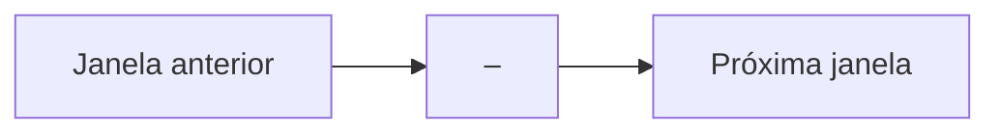

# QRDS — Ten-Phase Progress Update Template

**Window:** `<START>–<END>`
**Checkpoint phase:** `<END>`
**Commit:** `<COMMIT>`
**Gate:** `<GATE>`
**Status:** `<PASS_RESEARCH_ONLY | NEEDS_REVIEW>`

---

## 1. Resumo executivo

- Objetivo da janela:
- O que foi concluído:
- O que mudou materialmente:
- Principal evidência:
- Principal limitação:
- Próxima janela:

---

## 2. Resultado por fase

| Phase | Tema | Artifact | Teste | Gate | Status |
|---|---|---|---|---|---|
| `<START>` |  |  |  |  |  |
|  |  |  |  |  |  |
| `<END>` |  |  |  |  |  |

---

## 3. Evidência de testes

```text
Test files:
Collected tests:
Passed tests:
Failures:
Errors:
Hashes verified:
```

---

## 4. Mudanças de maturidade

| Camada | Antes | Depois | Evidência |
|---|---|---|---|
| Engenharia |  |  |  |
| Dados |  |  |  |
| Replay |  |  |  |
| Readiness |  |  |  |
| Operação |  |  |  |

---

## 5. Diagrama atualizado



---

## 6. Locks

```text
operational_status:
shadow_decision_allowed:
decision_layer_allowed:
promotion_allowed:
safe_apply_allowed:
trading_signal_generated:
recommendation_generated:
allocation_generated:
canonical_data_writes:
```

---

## 7. Decisão do checkpoint

```text
Research continuation allowed:
Operational use allowed:
Production trading ready:
Next stage:
```

---

## 8. Atualizações obrigatórias

- [ ] Atualizar `QRDS_MASTER_PROGRESS_BY_TENS_*.md`
- [ ] Adicionar linha na tabela por dezenas
- [ ] Atualizar Mermaid
- [ ] Registrar commit e gate
- [ ] Atualizar snapshot JSON
- [ ] Criar roadmap da próxima janela
- [ ] Confirmar locks
