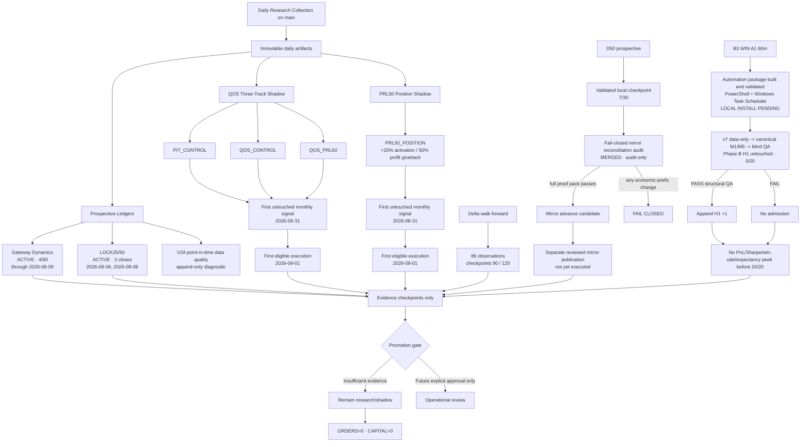

# GATE BTC / QRDS — Current System Diagram

As of: 2026-08-09

Safety boundary: `RESEARCH_ONLY` · `SHADOW_ONLY` · `NOT_APPROVED` · `ORDERS=0` · `REAL_CAPITAL=0`

## Frozen sequencing

1. Keep Daily Research Collection running without methodology changes.
2. Keep Gateway and LOCK25/50 prospective ledgers append-only.
3. Do not backfill QOS Three-Track or PRL50; wait for the first untouched 2026-08-31 signal.
4. Delta continues automatically to 90 and 120 observations without recalibration.
5. D50 preserves validated frozen/local history. The audit-only mirror reconciler is now merged; it may emit only a `PASS_MIRROR_ADVANCE_CANDIDATE` after the full provenance proof pack passes. Runtime publication remains a separate reviewed step, and any economic-field change fails closed.
6. B3 Phase B automation package is built and validated. It remains local-install pending; after install, Windows Task Scheduler runs v7 in data-only mode, passes canonical M1/M5 to blind QA, admits only structurally qualified sessions, and freezes automatically at 20/20.
7. B3 Phase B remains blind until H1 reaches 20/20 qualified sessions; only data-quality inspection is allowed beforehand.
8. No operational promotion, real capital, or order generation is authorized by this diagram.
